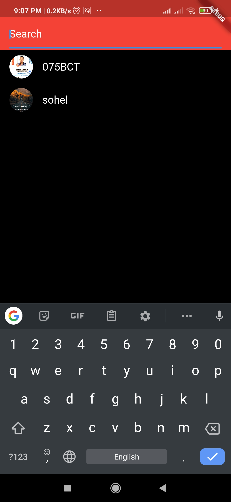

# TikTok Clone

TikTok App that works on Android & iOS!
 Get the app from the link below 
https://drive.google.com/file/d/1yAso1YnsyeU0ZNA0ttIW3l08x04K6jYg/view?usp=sharing

## Tech Used

<b>Flutter</b>, Firebase Auth, Firestore, Firebase Storage, GetX

**Architecture:** MVC

## Screenshots 

  
  
  
  

## Features
- TikTok Like UI
- Authentication with Email & Password
- Uploading Videos with Caption
- Compressing Videos
- Generating Thumbnails Out of Video
- Displaying Videos with Caption
- Liking on Posts
- Commenting on Posts
- Liking the Comments
- Searching Users
- Following Users
- Displaying Followers, Following, Likes & Posts of User

#### Special Thanks => Rivaan

<!--  -->

